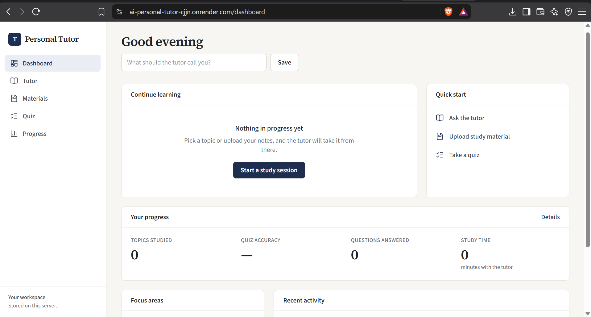
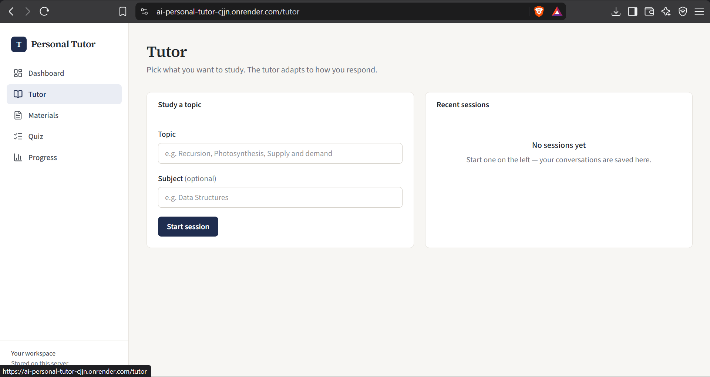
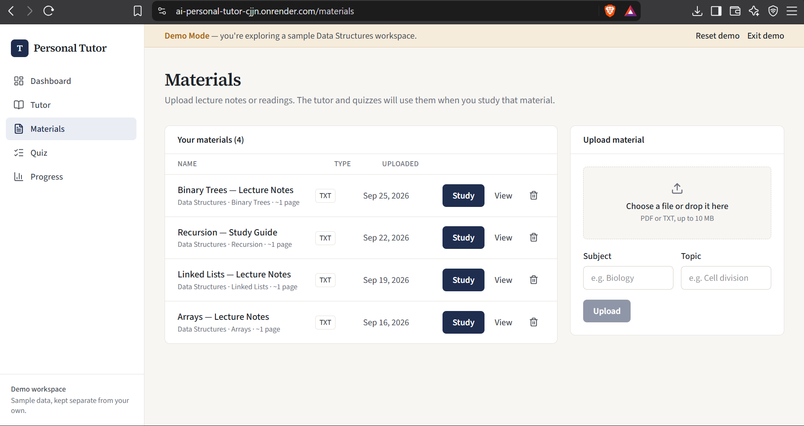
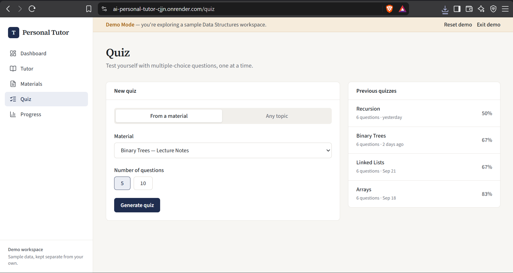
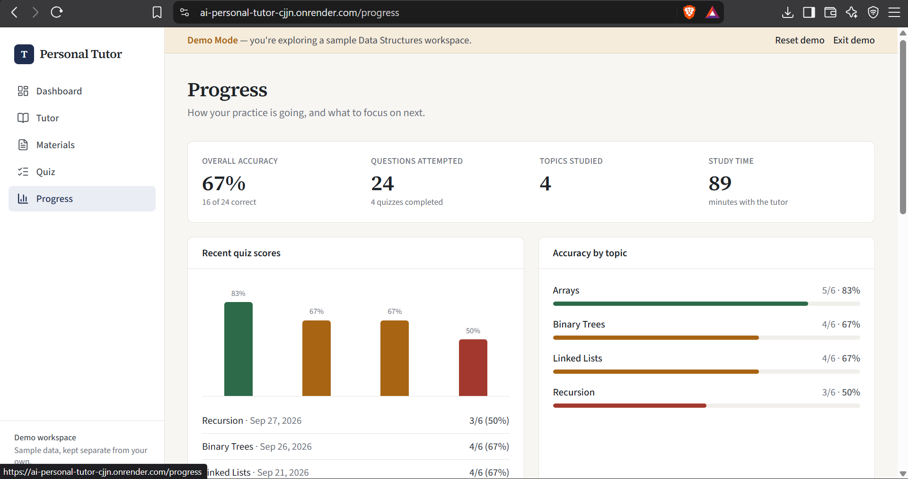

<div align="center">


<samp><b>AI PERSONAL TUTOR</b></samp>

<samp>next.js · typescript · gemini · sqlite</samp>

</div>

---

<div align="center"><samp>A personalised study platform that teaches concepts step by step, works from your own study materials, generates quizzes, and tracks where you need more practice.</samp></div>

---

<div align="center"><samp><b>Features</b></samp></div>

- <samp><b>Tutor</b> — a study workspace that explains concepts from the basics, uses examples and analogies, checks understanding, spots misconceptions, and gives hints before answers.</samp>
- <samp><b>Study materials</b> — upload PDF or TXT files up to 10 MB and use their extracted text as the source for tutoring and quizzes.</samp>
- <samp><b>Quizzes</b> — generate multiple-choice quizzes from a topic or study material, with server-side answer checking and explanations.</samp>
- <samp><b>Progress</b> — track accuracy, questions attempted, topics studied, study time, quiz scores, weak topics, and missed questions.</samp>
- <samp><b>Demo Mode</b> — a ready-made Data Structures workspace with sample notes, study sessions, quiz history, and progress.</samp>

---

<div align="center"><samp><b>Tech Stack</b></samp></div>

- <samp>Next.js 16 with App Router, route handlers, and server actions</samp>
- <samp>TypeScript</samp>
- <samp>Tailwind CSS v4</samp>
- <samp>Google Gemini through the official <code>@google/genai</code> SDK</samp>
- <samp>SQLite through Node's built-in <code>node:sqlite</code> module</samp>
- <samp><code>unpdf</code> for PDF text extraction</samp>
- <samp><code>react-markdown</code> for tutor replies</samp>
- <samp><code>lucide-react</code> for icons</samp>

---

<div align="center"><samp><b>Screenshots</b></samp></div>

| <samp>Dashboard</samp> | <samp>Tutor</samp> | <samp>Materials</samp> |
|---|---|---|
|  |  |  |

| <samp>Quiz</samp> | <samp>Progress</samp> |
|---|---|
|  |  |

---

<div align="center"><samp><b>Local Setup</b></samp></div>

<samp><b>Requirements</b></samp>

- <samp>Node.js 22.13 or newer</samp>
- <samp>npm</samp>

<samp><b>Install</b></samp>

```bash
npm install
cp .env.example .env.local
```

<samp>Add your Gemini API key to <code>.env.local</code>. Never commit the key.</samp>

---

<div align="center"><samp><b>Environment Variables</b></samp></div>

| <samp>Variable</samp> | <samp>Required</samp> | <samp>Description</samp> |
|---|---|---|
| <samp><code>GEMINI_API_KEY</code></samp> | <samp>Yes for live tutoring</samp> | <samp>Google Gemini API key</samp> |
| <samp><code>GEMINI_MODEL</code></samp> | <samp>No</samp> | <samp>Primary Gemini model</samp> |
| <samp><code>GEMINI_FALLBACK_MODELS</code></samp> | <samp>No</samp> | <samp>Comma-separated fallback models</samp> |
| <samp><code>DATABASE_DIR</code></samp> | <samp>No</samp> | <samp>Folder containing the SQLite database</samp> |

<samp>The Gemini key is read only in server code. The browser communicates with the application's own API routes and never calls Gemini directly.</samp>

---

<div align="center"><samp><b>Running the Project</b></samp></div>

```bash
npm run dev
npm run build
npm start
npm run lint
```

<samp>The development server normally runs at <code>http://localhost:3000</code>.</samp>

---

<div align="center"><samp><b>Demo Mode</b></samp></div>

1. <samp>Open the application and select <b>Try Demo</b>.</samp>
2. <samp>Use the sample Data Structures workspace to explore the tutor.</samp>
3. <samp>Open Materials and view a study guide.</samp>
4. <samp>Open Quiz, choose a material, and generate a quiz.</samp>
5. <samp>Answer a question to see feedback and an explanation.</samp>
6. <samp>Open Progress to review accuracy, scores, and weak topics.</samp>

<samp>The demo workspace can be reset and is stored separately from personal data. With <code>GEMINI_API_KEY</code> configured, the demo uses live Gemini responses with prepared fallback content when live models are unavailable. Fallback responses are explicitly labelled.</samp>

---

<div align="center"><samp><b>Deployment</b></samp></div>

<samp>The application requires a Node.js server because it uses API routes and SQLite.</samp>

<samp><b>Persistent deployment:</b> Render, Railway, Fly.io, or a VPS can run the production server with a persistent disk for the database and uploaded data.</samp>

```text
Build: npm install && npm run build
Start: npm start
```

<samp>Set <code>GEMINI_API_KEY</code> in the deployment environment and configure <code>DATABASE_DIR</code> to point to persistent storage.</samp>

<samp><b>Live Demo:</b> <code>https://ai-personal-tutor-cjjn.onrender.com</code></samp>

<samp><b>Vercel:</b> suitable for a demo, but the current SQLite database uses temporary storage there, so personal uploads and progress may reset.</samp>

---

<div align="center"><samp><b>Project Structure</b></samp></div>

```text
app/
├── page.tsx                 Landing page
├── actions.ts               Server actions
├── (app)/                   Dashboard, tutor, materials, quiz, progress
└── api/
    ├── chat/                Tutor responses
    ├── materials/           PDF/TXT upload and extraction
    └── quiz/                Quiz generation and answer checking
components/                  Reusable UI components
lib/
├── gemini.ts                Gemini client and error mapping
├── prompts.ts               Tutor and quiz prompts
├── db.ts, data.ts           SQLite schema and queries
├── progress.ts              Progress statistics
└── demo.ts                  Demo seeding and fallback replies
data/                        Demo materials, questions, and replies
images/                      README screenshots
types/                       Shared TypeScript types
public/                      Static assets
```

---

<div align="center"><samp><b>Notes</b></samp></div>

- <samp>Scanned PDFs without a text layer cannot currently be read.</samp>
- <samp>Very long documents are trimmed to roughly the first 40 pages when sent to the tutor.</samp>
- <samp>Tutor responses can be incorrect; important facts should be checked against course material.</samp>

---

<div align="center"><samp><b>Author</b></samp></div>

<div align="center">
<samp><strong>Yoson</strong></samp>

<samp>Computer Science student interested in AI/ML, robotics, embedded systems, and automation.</samp>
</div>
